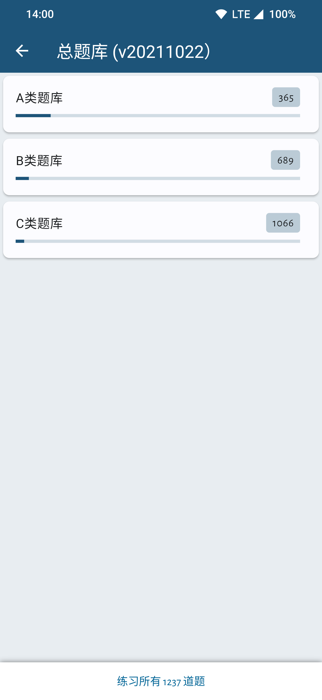
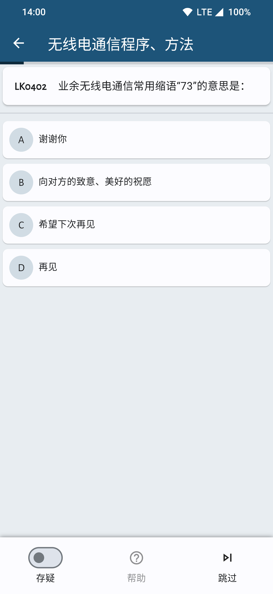

# HamfistedCN [WIP|尚未完成]

 

[简体中文](./README.md) | [English](./README_EN.md)
 

**替换了中国业余无线电台操作技术能力验证题库的 [hamfisted](https://github.com/specht/hamfisted) 分支**

hamfisted 原为一款开源的德国业余无线电考试题库学习软件。我在这个软件的基础上替换了中国业余无线电台操作技术能力验证题库（A、B、C 类）。

我只是编程新手，学会的不多。只是做了替换了题库的工作（这涉及的代码很少），但它可以运行并且实现了功能，对我很有帮助，所以我发布了出来，希望能帮助更多备考中国业余无线电台操作技术能力验证的人。

得益于原应用使用 Flutter 这一跨平台框架开发，该应用可以发布到不同平台，即理论上可以在 Android、iOS、Windows、Linux、MacOS 等平台上使用该软件，但我不知道该如何发布到除 Android 以外的平台（原 App 的 Release 也只有 Android 平台的安装包），所以目前只发布 Android 平台的安装包。

## **下载**

## **修改**

- 把原德国题库替换为中国题库，最新（2024-06-06）版本是 CARC 发布的 v20211022

- 删除了介绍界面

- 修改应用语言为中文

## **截图**

 
 
 

