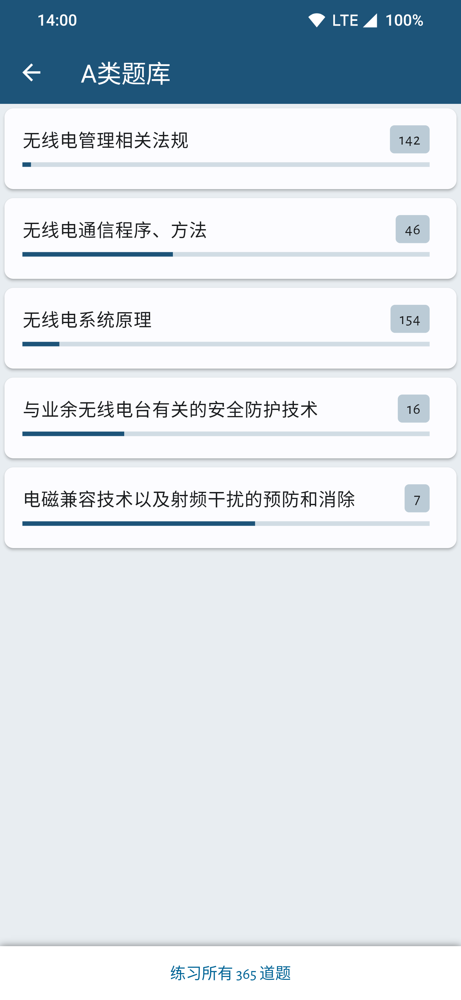

# HamfistedCN [WIP|尚未完成]

 

[简体中文](./README.md) | [English](./README_EN.md)
 

**A fork of [hamfisted](https://github.com/specht/hamfisted) that replaced the Chinese amateur radio exam question bank**

Hamfisted was originally an open source App for preparing for the German HAM radio license exam. Based on this software, I replaced the question bank for the Chinese amateur radio exam (including A, B, and C categories).

I am just a beginner in programming and don't know much. I just replaced the question bank (which involves very little code), but it works and implements the function, which is very helpful to me, so I posted it, hoping to help more people preparing for the China Amateur Radio Station Operation Technical Competency Verification.

Thanks to the fact that the original app was developed using the cross-platform framework Flutter, the app can be released on different platforms. but I don’t know how to release it to platforms other than Android (the original App’s Release also only has Android installation packages). So I currently only release the installation package for the Android platform.

## **Download**

## **Changes**

- Replace the original German question bank with the Chinese question bank. The latest (2024-06-06) version is v20211022 released by CARC.

- Deleted the intropage.

- Change the application language to Chinese.

## **Screenshots**

 
 
 

